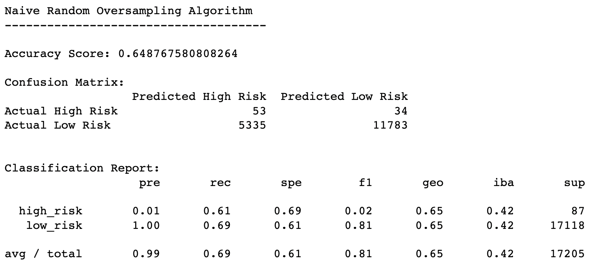
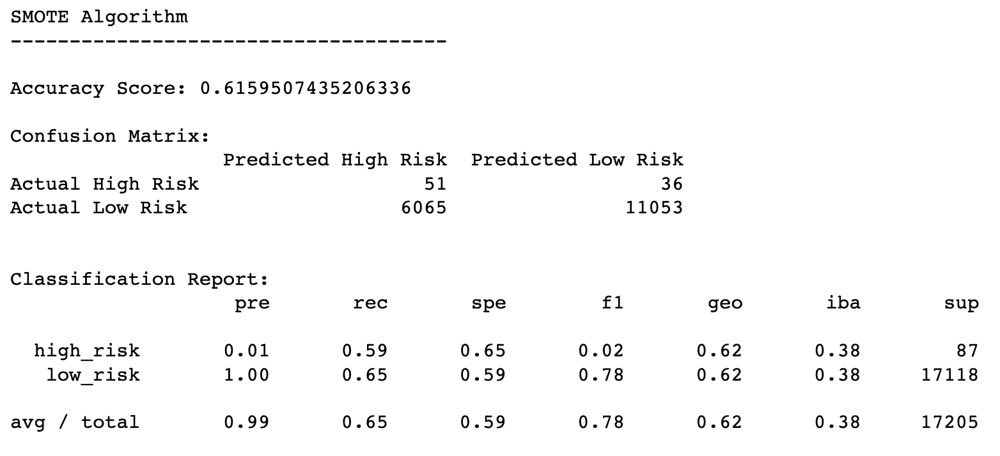
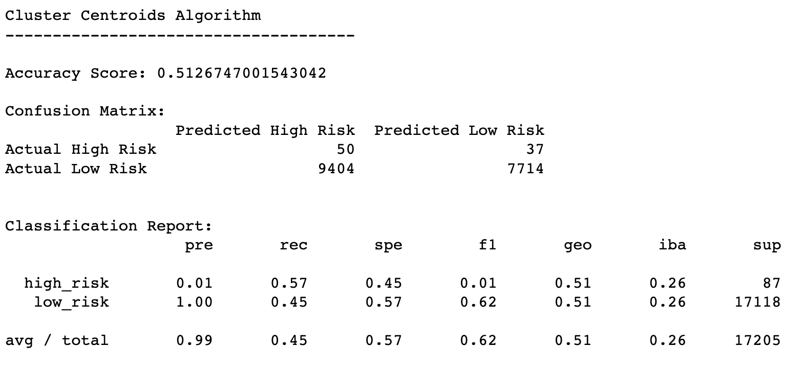
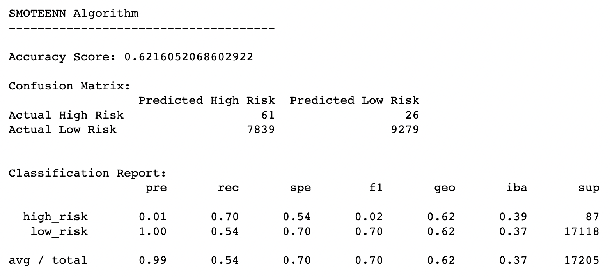
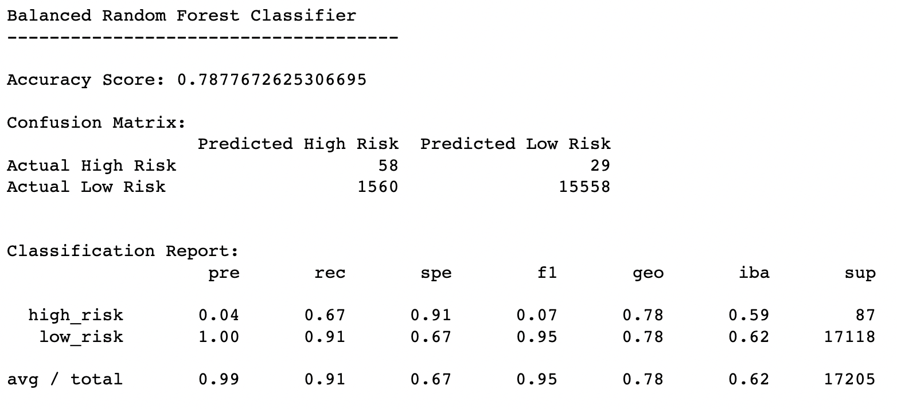
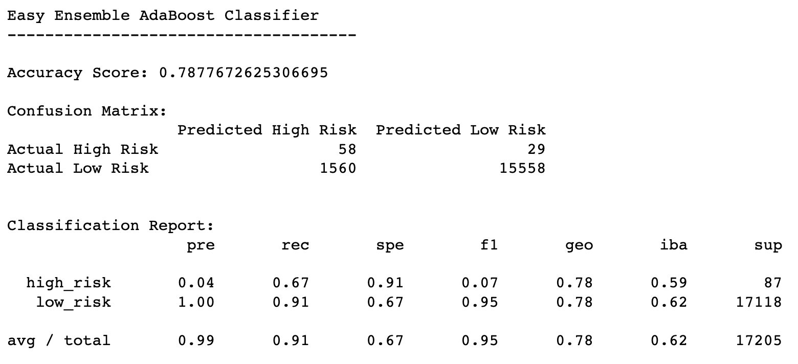

# 17-Credit_Risk_Analysis-lukeperrin

## Overview

Machine Learning is a useful tool to help shed light on possible future outcomes. Using the power of statistical method application on historical datasets, we can begin to predict the future (to a degree).

This data-driven science is of high interest to companies that deal with financial risk. This exercise looks at several ML models and algorithms by applying each to a credit line applicant database. By using trends within data and stastical methods, we can assess what the predicted outcomes of creditors are as well as determine how reliable these predictions will be.

The dataset is found at  [LoanStats_2019Q1.csv](Resources/LoanStats_2019Q1.csv) .

## Results

The results for each of the six models were achieved by using these scripts:
 [credit_risk_resampling.ipynb](credit_risk_resampling.ipynb) 
 [credit_risk_ensemble.ipynb](credit_risk_ensemble.ipynb) 

### Naive Random Oversampling Model

- Balanced Accuracy Score

  - This model demonstrates moderately accurate predictions relative to all six models.
  - This model is expected to accurately predict credit risk categories 64.9% of the time.  

- Precision (`pre` in the classification report)

  - This model demonstrates highly precise predictions relative to all six models.
  - This model is expected to correctly (i.e. predict actual credit risk) 99% of the time on average.

- Recall (`rec` in the classification report)

  - This model presents recall values that suggest that the classifier is expected to properly categorize high credit risk 61% of the time and low credit risk 69% of the time.

  - This method presents an appreciable recall value compared to all the resampling models. 

    

### SMOTE Oversampling Model

- Balanced Accuracy Score

  - This model demonstrates moderately accurate predictions relative to all six models (about equal to Naive Random Oversampling).
  - This model is expected to accurately predict credit risk categories 61.6% of the time.  

- Precision (`pre` in the classification report)

  - This model demonstrates highly precise predictions relative to all six models.
  - This model is expected to correctly (i.e. predict actual credit risk) 99% of the time on average.

- Recall (`rec` in the classification report)

  - This model presents recall values that suggest that the classifier is expected to properly categorize high credit risk 59% of the time and low credit risk 65% of the time.

  - This method presents the a less desirable recall value than Naive Random Oversampling. 

    

### Cluster Centroids Undersampling Model

- Balanced Accuracy Score

  - This model demonstrates the less accurate predictions relative to all six models.
  - This model is expected to accurately predict credit risk categories 51.3% of the time.  

- Precision (`pre` in the classification report)

  - This model demonstrates highly predictions relative to all six models (and equal to both oversampling models.
  - This model is expected to correctly (i.e. predict actual credit risk) 99% of the time on average.

- Recall (`rec` in the classification report)

  - This model presents recall values that suggest that the classifier is expected to properly categorize high credit risk 57% of the time and low credit risk 45% of the time.

  - This method presents a poor recall value compared to all the of resampling models. 

    

### SMOTEENN Combination Sampling Model

- Balanced Accuracy Score

  - This model demonstrates moderately accurate predictions relative to all six models.
  - This model is expected to accurately predict credit risk categories 62.2% of the time.  

- Precision (`pre` in the classification report)

  - This model demonstrates highly precise predictions relative to all six models (and equal to all over-/under- sampling models).
  - This model is expected to correctly (i.e. predict actual credit risk) 99% of the time on average.

- Recall (`rec` in the classification report)

  - This model presents recall values that suggest that the classifier is expected to properly categorize high credit risk 70% of the time and low credit risk 54% of the time.

  - This method presents the best recall value of all the resampling models, but not as good as the classifier models below.

    

### Balanced Random Forest Classifier

- Balanced Accuracy Score

  - This model demonstrates exceptionally accurate predictions relative to all six models.
  - This model is expected to accurately predict credit risk categories 78.8% of the time.  

- Precision (`pre` in the classification report)

  - This model demonstrates highly precise predictions relative to all six models.
  - This model is expected to correctly (i.e. predict actual credit risk) 99% of the time on average.

- Recall (`rec` in the classification report)

  - This model presents recall values that suggest that the classifier is expected to properly categorize high credit risk 67% of the time and low credit risk 91% of the time.

  - The ensemble classifier methods present the best recall values of all the models.

    

### Easy Ensemble AdaBoost Classifier

- This model presents identically impressive accuracy, precision, and recall values as  the Balanced Random Forest Classifier.

  

## Summary

Since there is an interest to prevent unknowingly lending  to high credit risk applicants (i.e. falsely determined to be low risk), either of the classsifier models would serve well to avoid this false classification due to their high recall values. We also can observe that they offer higher accuracy and comparable precision to the resampling models.

